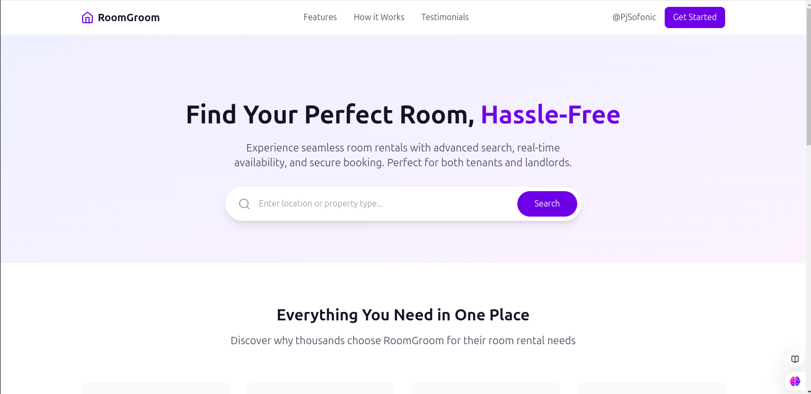
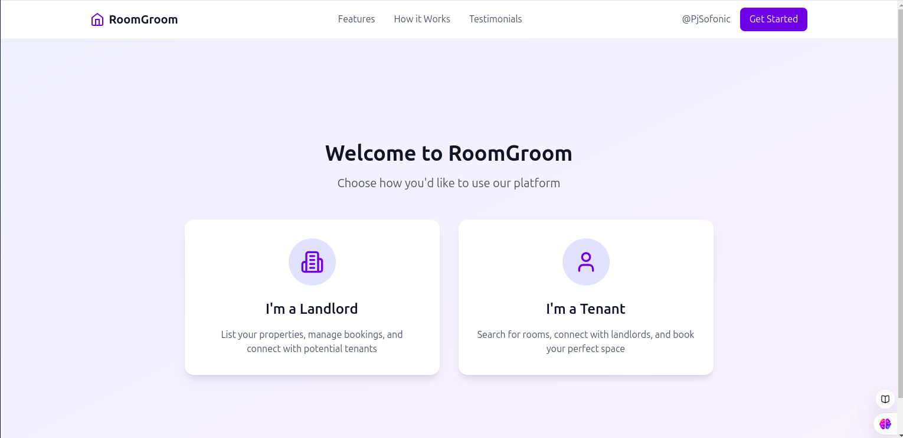

# Room Groom

**Room Groom** is an innovative platform designed to simplify room rentals. It helps users find, book, and manage accommodations while empowering landlords to list their properties efficiently. This platform is built with a focus on usability, trust, and transparency.

#Live
https://room-groom-c9f1nmycb-programerpj69s-projects.vercel.app

## Table of Contents
1. [Introduction](#introduction)
2. [Features](#features)
3. [Technology Stack](#technology-stack)
4. [Setup and Installation](#setup-and-installation)
5. [Usage](#usage)
6. [Screenshots](#screenshots)
7. [Future Enhancements](#future-enhancements)

---

## Introduction

The **Room Groom** platform connects tenants and landlords to create a seamless room rental experience. With features like user authentication, room listing, and Google Maps integration, it bridges the gap between property owners and room seekers.

---

## Features
- **User Authentication**: Secure sign-up and login system using Firebase.
- **Room Listings**: Landlords can list rooms with title, price, and location details.
- **Search & Filter**: Tenants can search and filter rooms based on location and budget.
- **Map Integration**: Google Maps for exploring property locations.
- **Real-time Chat**: Communication between landlords and tenants (upcoming).

---

## Technology Stack

### Frontend:
- **React.js**: For building the user interface.

### Backend:
- **Firebase**:
  - Authentication
  - Firestore Database

### APIs:
- **Google Maps API**: To display property locations.
- **Stripe API**: (Planned) for secure payment processing.

---

## Setup and Installation

Follow these steps to set up and run the project locally:

### Prerequisites
- Install [Node.js](https://nodejs.org/)
- Install [Visual Studio Code](https://code.visualstudio.com/)

### Steps
1. Clone the repository:
   ```bash
   git clone https://github.com/programerPj69/room-groom.git
   cd room-groom
   ```
2. Install dependencies:
   ```bash
   npm install
   ```
3. Set up Firebase:
   - Go to [Firebase Console](https://console.firebase.google.com/).
   - Create a project and get your Firebase config details.
   - Add your Firebase config to `firebase.js` in the `src` folder.

4. Start the development server:
   ```bash
   npm start
   ```
   - Open your browser and navigate to [http://localhost:3000](http://localhost:3000).

---

## Usage

### Adding a Room
1. Log in as a landlord.
2. Fill out the room listing form (title, price, location).
3. Submit the form to save the listing to Firebase.

### Searching for a Room
1. Log in as a tenant.
2. Use the search bar and filters to find suitable accommodations.
3. View room details on the map.

---

## Screenshots

### Homepage


### Add Room Page


---

## Future Enhancements
- Add real-time chat between landlords and tenants.
- Integrate payment gateway (Stripe).
- Add reviews and ratings for rooms.
- Implement a mobile-friendly design.

---

## License
This project is licensed under the MIT License. See the [LICENSE](LICENSE) file for details.

---

## Acknowledgements
- [React.js Documentation](https://reactjs.org/docs/getting-started.html)
- [Firebase Documentation](https://firebase.google.com/docs)
- [Google Maps API](https://developers.google.com/maps/documentation)
- [Stripe API Documentation](https://stripe.com/docs)

---

### Contribute
Feel free to fork this repository, report bugs, or request features by opening an issue.

---
